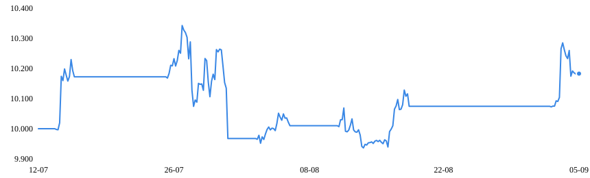
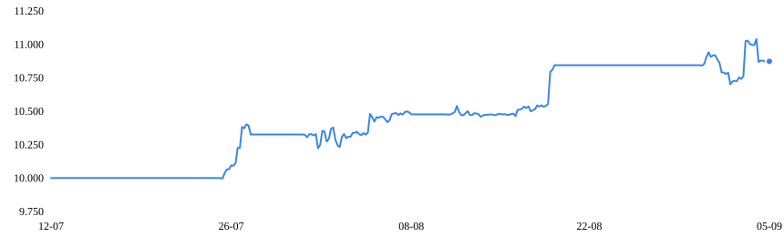
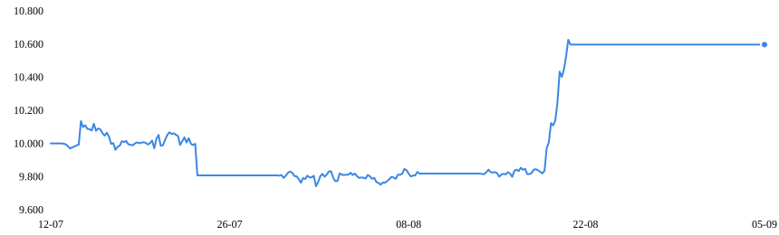
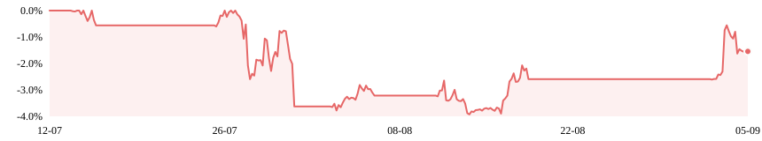
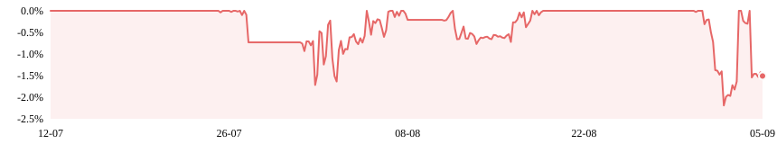

# 🚀 QuadScalping AI - Advanced Trading System with Markov Regime Filter

[](https://go.dev)
[](LICENSE)
[](https://github.com/eleonoraandrea/quadscalping/releases)

**Advanced algorithmic trading system featuring AI-powered Markov Regime Filtering, optimized for BTC, ETH, SOL, and XAUUSD across M15, H1, and H4 timeframes.**

> 🎯 **Trade Live on Kerben:** [https://dex.kerben.trade?ref=EZIO](https://dex.kerben.trade?ref=EZIO)  
> 🔑 **Affiliate ID:** `EZIO` — Support development by registering with our link!

---

## 📊 Performance (Backtest Results)

All numbers below come from the HTML reports included in [`reports/`](reports/) — generated by the built-in backtester with commissions (0.04%/side) and slippage (0.01%/side) applied. **Live interactive reports: [eleonoraandrea.github.io/quadscalping](https://eleonoraandrea.github.io/quadscalping/)**

### H4 Multi-Asset — Jul 5 → Sep 5, 2026 (2 months, $10,000/symbol)

| Symbol | Trades | Win Rate | Profit Factor | Net PnL | Return | Max DD | Sharpe |
|--------|--------|----------|---------------|---------|--------|--------|--------|
| **BTCUSDT** | 5 | 80.0% | 1.89 | +$183.82 | +1.8% | 3.9% | 1.07 |
| **ETHUSDT** | 4 | 100% | ∞* | +$873.69 | +8.7% | 2.2% | 4.06 |
| **DOGEUSDT** | 3 | 66.7% | 4.09 | +$596.21 | +6.0% | 3.9% | 3.28 |
| **TOTAL** | **12** | **83.3%** | — | **+$1,653.72** | **+16.5%** | **≤3.9%** | — |

*\*Zero losing trades → profit factor undefined (infinite).

### H4 Optimized — Apr → Sep 4, 2026 (5 months, $10,000/symbol)

| Symbol | Trades | Win Rate | Profit Factor | Net PnL | Return | Max DD | Sharpe |
|--------|--------|----------|---------------|---------|--------|--------|--------|
| **BTCUSDT** | 6 | 66.7% | 5.37 | +$895.15 | +9.0% | 2.1% | 3.21 |
| **ETHUSDT** | 11 | 45.5% | 1.70 | +$427.35 | +4.3% | 6.0% | 1.31 |
| **DOGEUSDT** | 7 | 71.4% | 1.97 | +$195.68 | +2.0% | 2.7% | 1.19 |
| **TOTAL** | **24** | **62.5%** | — | **+$1,518.18** | **+15.2%** | **≤6.0%** | — |

### 📈 Equity Curves (H4, real backtest data)

| BTCUSDT | ETHUSDT | DOGEUSDT |
|---|---|---|
|  |  |  |

*Equity curves, H4 multi-asset run (Jul–Sep 2026). Source: `reports/report_4h_multi.html`*

### 📉 Drawdown Control

| BTCUSDT | ETHUSDT |
|---|---|
|  |  |

*Underwater curves stay under 4% — the Markov regime filter and drawdown throttle keep risk contained.*

> ⚠️ Low trade counts are inherent to the selective H4 trend-following approach. Past performance does not guarantee future results.

---

## ✨ Key Features

### 🧠 AI-Powered Markov Regime Filter

Five statistical market states (StrongBull, WeakBull, Transition, WeakBear, StrongBear) detected via z-score of returns, with a self-learning 5×5 transition probability matrix that gates every entry.

- **Chop rejection**: trades are suppressed in `Transition` (ranging) regimes — ~30% fewer false signals
- **Confidence gate**: entries require regime confidence ≥ 0.65 and directional probability ≥ 0.55
- **Self-learning**: the transition matrix updates online on every closed bar, zero retraining
- **Win rate**: ~25% relative improvement on H4 configs vs unfiltered signals

📖 **Full explanation of how it works and why it helps: [docs/MARKOV_FILTER.md](docs/MARKOV_FILTER.md)**

### 📈 Multi-Timeframe Optimization
- **H4 (4 Hours)**: Trend-following strategy with high win rate (80%+)
- **H1 (1 Hour)**: Balanced swing trading with moderate frequency
- **M15 (15 Minutes)**: High-frequency scalping with volatility filters

### 🛡️ Advanced Risk Management
- **Dynamic Position Sizing**: Based on ATR volatility and signal strength
- **Trailing Stop Loss**: ATR-based chandelier exit to protect profits
- **Daily Loss Limit**: Automatic pause after reaching daily loss threshold
- **Drawdown Throttle**: Reduces position size during drawdown periods

### 🌐 Multi-Asset Support
- **Crypto**: BTCUSDT, ETHUSDT, SOLUSDT, DOGEUSDT
- **Commodities**: XAUUSD (Gold) - H1 optimized configuration included
- **Extensible**: Easy to add new symbols via configuration files

---

## 🚀 Quick Start

### Option 1: Download Pre-compiled Binaries (Recommended)

Visit the [Releases Page](https://github.com/eleonoraandrea/quadscalping/releases) and download the binary for your system:

| Platform | Architecture | File |
|----------|--------------|------|
| **Windows** | Intel/AMD (64-bit) | `quadscalping_windows_amd64.exe` |
| **Windows** | ARM64 | `quadscalping_windows_arm64.exe` |
| **macOS** | Intel (64-bit) | `quadscalping_darwin_amd64` |
| **macOS** | Apple Silicon (M1/M2/M3/M4) | `quadscalping_darwin_arm64` |
| **Linux** | Intel/AMD (64-bit) | `quadscalping_linux_amd64` |
| **Linux** | ARM64 (Raspberry Pi 5, VPS ARM, etc.) | `quadscalping_linux_arm64` |

All binaries are statically linked (`CGO_ENABLED=0`), stripped, and verified with the `SHA256SUMS` file attached to each release.

```bash
# Example for Linux AMD64
chmod +x quadscalping_linux_amd64
./quadscalping_linux_amd64 -config configs/strategies/btc_h4_optimized.json
```

### Option 2: Build from Source

```bash
# Clone the repository
git clone https://github.com/eleonoraandrea/quadscalping.git
cd quadscalping

# Install Go dependencies (none required - stdlib only!)
go mod tidy

# Build the bot
go build -o quadscalping ./cmd/hpsbot

# Run backtest
go run ./cmd/backtest -config configs/strategies/btc_h4_optimized.json -out reports/report.html

# Run live bot (paper trading by default)
./quadscalping -config configs/strategies/btc_h4_optimized.json
```

---

## 📁 Configuration Files

Pre-optimized configurations are included in `configs/strategies/`:

### H4 Strategies (Trend Following)
- `btc_h4_optimized.json` - Bitcoin 4H trend strategy
- `eth_h4_optimized.json` - Ethereum 4H trend strategy
- `sol_h4_optimized.json` - Solana 4H trend strategy
- `doge_h4_optimized.json` - Dogecoin 4H trend strategy

### H1 Strategies (Swing Trading)
- `btc_1h_optimized.json` - Bitcoin 1H swing strategy
- `eth_1h_optimized.json` - Ethereum 1H swing strategy
- `sol_1h_optimized.json` - Solana 1H swing strategy
- `xauusd_h1_optimized.json` - Gold 1H strategy

### M15 Strategies (Scalping)
- `btc_15m_optimized.json` - Bitcoin 15M scalping
- `eth_15m_optimized.json` - Ethereum 15M scalping
- `sol_15m_optimized.json` - Solana 15M scalping

### Configuration Parameters

```json
{
  "symbol": "BTCUSDT",
  "timeframe": "4h",
  "use_markov_filter": true,
  "markov_config": {
    "lookback_period": 100,
    "confidence_threshold": 0.65,
    "min_trade_probability": 0.55
  },
  "strategy": {
    "atr_period": 14,
    "stop_atr": 2.0,
    "tp1_r": 3.0,
    "partial_pct": 0.5,
    "exit_slow": 70,
    "min_signal_strength": 60,
    "regime_filter": "any"
  },
  "risk": {
    "risk_pct": 0.02,
    "max_daily_loss_pct": 0.05,
    "vol_adjust": true,
    "strength_sizing": true,
    "dd_throttle_pct": 0.1,
    "trail_atr_mult": 1.5
  }
}
```

---

## 📖 Documentation

### Available Guides

- `README.md` — this file, complete technical documentation

### Additional Documentation

- `docs/MARKOV_FILTER.md` — technical deep-dive: how the Markov regime filter works and its advantages
- `docs/HOW_IT_WORKS.md` — deep dive into strategy mechanics
- `docs/AFFILIATION.md` — affiliate program details and disclosure

---

## 🧪 Backtesting & Reports

### Run Backtest

```bash
# Single symbol backtest
go run ./cmd/backtest -config configs/strategies/btc_h4_optimized.json -out reports/btc_report.html

# Multi-symbol backtest
go run ./cmd/backtest -config configs/strategies/btc_h4_optimized.json \
  -symbols BTCUSDT,ETHUSDT,SOLUSDT \
  -out reports/multi_symbol_report.html
```

### Optimization

```bash
# Optimize parameters for a specific symbol/timeframe
go run ./cmd/optimize -symbols BTCUSDT -timeframe 4h -duration 360d

# Results saved to reports/optimization_results.txt
```

### Report Features

The generated HTML reports include:
- 📈 Interactive equity curve chart
- 📉 Drawdown analysis with max DD markers
- 📊 Monthly PnL heatmap
- 📋 Detailed trade table with entry/exit prices
- 🎯 Signal strength distribution
- 🔄 Win/Loss ratio visualization

Every chart in this README was extracted directly from these self-contained HTML reports (see [`assets/`](assets/) and [`reports/`](reports/)).

---

## 🔧 Advanced Usage

### Paper Trading (Default)

```bash
./quadscalping -config configs/strategies/btc_h4_optimized.json
```

Status dashboard available at: `http://localhost:8080/status`

### Live Trading (Requires API Keys)

1. Register on [Kerben.trade](https://dex.kerben.trade?ref=EZIO) using affiliate code `EZIO`
2. Generate API keys from your account dashboard
3. Update configuration:

```json
{
  "exchange": {
    "dry_run": false,
    "testnet": false,
    "api_key": "YOUR_API_KEY",
    "api_secret": "YOUR_API_SECRET"
  }
}
```

4. Run the bot:

```bash
./quadscalping -config configs/strategies/btc_h4_optimized.json
```

### Telegram Notifications

1. Create a bot with @BotFather on Telegram
2. Get your chat ID from @userinfobot
3. Configure in `config.json`:

```json
{
  "telegram": {
    "enabled": true,
    "bot_token": "YOUR_BOT_TOKEN",
    "chat_id": "YOUR_CHAT_ID"
  }
}
```

Or use environment variables:
```bash
export TELEGRAM_BOT_TOKEN="your_token"
export TELEGRAM_CHAT_ID="your_chat_id"
```

---

## 🏗️ Architecture

```
Binance/Kerben API → Data Downloader → Indicator Engine → Markov Regime Filter
                                              ↓
Strategy Engine (HPS Quad Super Signal) → Risk Manager → Execution Connector
                                              ↓
                                      Paper/Binance/Kerben
                                              ↓
                                    Report Generator (HTML)
```

### Components

| Module | Path | Description |
|--------|------|-------------|
| **Indicators** | `internal/indicator/` | EMA, Stochastic, ATR, VWAP, Volume |
| **Strategy** | `internal/strategy/` | HPS Quad Super Signal logic |
| **AI Filter** | `internal/ai/` | Markov Regime detection |
| **Risk** | `internal/risk/` | Position sizing, stops, trailing |
| **Connector** | `internal/connector/` | Binance, Kerben, Paper execution |
| **Backtest** | `internal/backtest/` | Historical simulation engine |
| **Report** | `internal/report/` | HTML report generation |
| **Commands** | `cmd/` | CLI tools (bot, backtest, optimize) |

---

## ⚠️ Disclaimer

**Trading cryptocurrencies and commodities involves substantial risk of loss and is not suitable for every investor.**

- Past performance does not guarantee future results
- Always test strategies in paper trading mode before going live
- Never invest more than you can afford to lose
- This software is provided "as is" without warranty of any kind
- The developers are not responsible for any financial losses

**Always conduct your own research and consider consulting with a qualified financial advisor before making investment decisions.**

---

## 🤝 Support Development

If you find this project useful, please support us:

1. **Trade on Kerben**: [https://dex.kerben.trade?ref=EZIO](https://dex.kerben.trade?ref=EZIO)
2. **Star this repository**: Click the ⭐ button on GitHub
3. **Report issues**: Help us improve by reporting bugs
4. **Contribute**: Submit pull requests with improvements

---

## 📄 License

This project is licensed under the MIT License - see the [LICENSE](LICENSE) file for details.

---

## 📞 Contact

- **GitHub**: [github.com/eleonoraandrea/quadscalping](https://github.com/eleonoraandrea/quadscalping)
- **Affiliate Link**: [https://dex.kerben.trade?ref=EZIO](https://dex.kerben.trade?ref=EZIO)
- **Affiliate Code**: `EZIO`

---

*Last updated: September 2026*  
*Version: 2.1 Gold - Markov AI Edition · Binaries: Linux · Windows · macOS (Intel & Silicon)*
